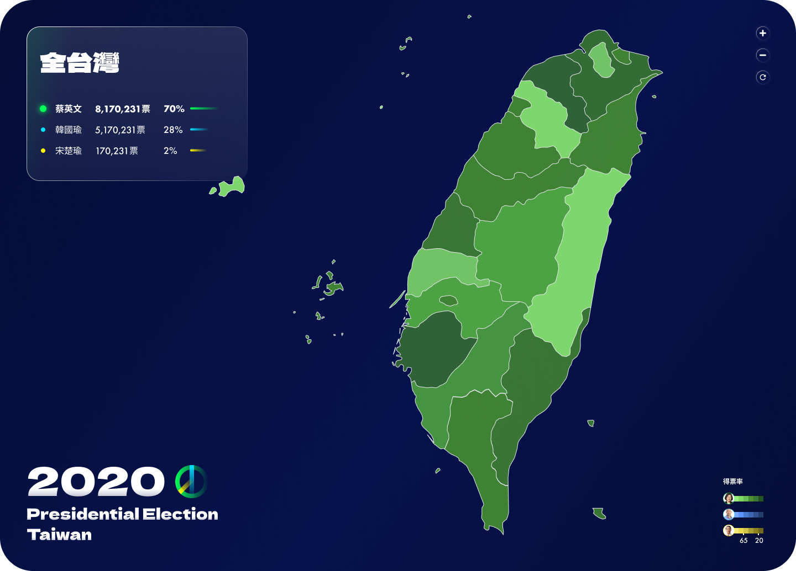
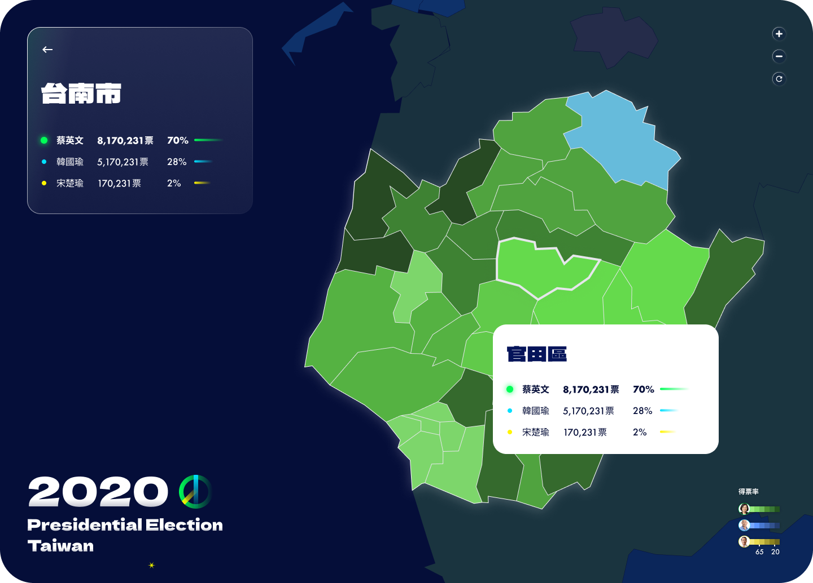

# 2020 總統大選地圖 2020 Presidential Election Taiwan
## 作品說明
探索台灣 2020 總統大選的動態地圖：一眼可見的色彩分佈，快速揭示全台灣各鄉鎮里的選舉動向，帶你深入了解這場歷史性的政治潮流。

1. 以地圖顏色了解區域選舉狀況

2. 點擊指定區域，查看該區域選票分佈，維度至鄉鎮里

3. 支援 Mobile 格式
   

## 系統說明
### 運行方式
- 安裝依賴: `npm install`
- 啟動服務: `npm run dev`
- Node.js 版本 v16.20.0

## 主要資料夾結構
- assets: 圖片資源檔案
- components : 共用元件與頁面邏輯
- data：經過處理的選舉資料
- helpers：共元的 web utils
- script：資料處理過程與邏輯

## 使用技術
- React＋TypeScript：使用 React 18 為前端框架，搭配 TypeScript 撰寫
- Vite：使用 Vite 作為前端開發和打包工具，提供快速的 HMR 和更佳的開發體驗
- axios

## 第三方服務
-  [react-svg-zoom-map](https://github.com/cybermumu/react-svg-zoom-map/tree/master)：台灣 svg 互動地圖
- d3.js：用於創建動態、互動式的數據可視化，在此專案中，d3.js 被用於渲染和操作選舉數據的圖表展示
- csv-parser：解析和處理CSV格式的原始選舉數據，使其能夠在應用程式中被有效利用
- style-component：CSS-in-JS，React 應用中創建和管理樣式，使樣式定義更加模組化與提升複用性

## 其他技術說明
1. 由於此專案串接的地圖為 class component，但撰寫的元件為 hook，因此會有混用情況
2. 專案使用 eslint + prettier 以維持程式碼整潔
3. script 資料產出方式為： `node 'src/script/index.js'`，會產出 json 格式檔案

## 資料來源
[選舉公投資料庫：2020 第15任總統副總統選舉](https://db.cec.gov.tw/ElecTable/Election/ElecTickets?dataType=tickets&typeId=ELC&subjectId=P0&legisId=00&themeId=1f7d9f4f6bfe06fdaf4db7df2ed4d60c&dataLevel=N&prvCode=00&cityCode=000&areaCode=00&deptCode=000&liCode=0000)

## Demo 路徑：
https://thenchair.github.io/PVMT/
